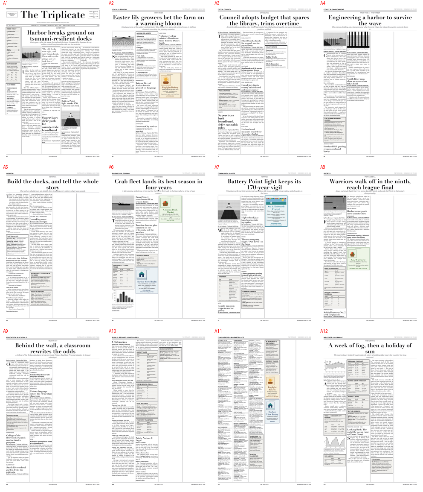

# The Triplicate — `template_newspaper`

> A data-driven, large-format **newspaper layout engine**. It renders a complete
> 12-page US Tabloid (11″ × 17″) edition — *The Triplicate* of Crescent City,
> California — to a print-ready PDF from structured YAML content, using
> pure-Python ReportLab. Broadsheet is a supported alternate trim
> (`render.page: broadsheet`); the shipped default is tabloid. Swapping editions
> is a data edit; the engine never changes.



This is a canonical exemplar sibling of [`template_code_project`](../template_code_project/)
and [`template_prose_project`](../template_prose_project/): same directory contract
(`src/` + `tests/` + optional `scripts/`/`manuscript/`), same orchestration
hooks, same documentation conventions — but where those render a *manuscript*,
this renders a *newspaper*.

## Run via the template monorepo

This exemplar lives at `projects/templates/template_newspaper/` in the public
[docxology/template](https://github.com/docxology/template) repository.
**Tests, analysis, PDF rendering, and CI all run through that monorepo** —
clone it, run `uv sync` at the repository root, then:

```bash
./run.sh --project templates/template_newspaper --pipeline --core-only
# or: uv run python scripts/execute_pipeline.py --project templates/template_newspaper --core-only
```

Several exemplars also publish standalone GitHub/Zenodo releases for citation;
those mirrors are outputs of this pipeline. The monorepo remains the canonical
build and render surface.

## When to use this template

Use this template when you need **data-driven, large-format print layout**:
multi-page broadsheets/tabloids with precise column geometry,
typography-first constraints, and strict content/engine separation (YAML
editions in `content/`, pure-Python ReportLab engine in `src/`). If you are
producing a research manuscript rather than a designed layout, see
[`template_code_project`](../template_code_project/) or
[`template_prose_project`](../template_prose_project/) instead. Full roster:
[`projects/AGENTS.md`](../../AGENTS.md#permanent-canonical-exemplars-and-optional-search-add-on).

---

## What it produces

A **12-page US Tabloid (11″ × 17″) edition**, `output/pdf/the-triplicate.pdf`:

| Page | Section | Layout features |
|-----:|---------|-----------------|
| A1 | Front Page | Nameplate, ears, left rail (index/weather/refers), spanning lead headline, drop cap, halftone art, pull quote |
| A2 | Local & Region | Section lead, "Around Del Norte" briefs, multi-story flow |
| A3 | City & County | Council lead, public-notices box, government briefs |
| A4 | Coast & Environment | Feature lead (jump from A1), tsunami-prep sidebar, charts |
| A5 | Opinion | Staff masthead, editorial, letters, signed column, "Today in History" |
| A6 | Business & Fishing | Dungeness landings chart, dock-price table, business briefs |
| A7 | Community & Arts | Lighthouse feature, weekly calendar table, arts briefs |
| A8 | Sports | Game lead, prep scoreboard + standings tables |
| A9 | Education & Schools | Pelican Bay degree feature, school notes |
| A10 | Public Record & Obituaries | Obituaries, sheriff's log, vital records, legal notices |
| A11 | Classifieds & Marketplace | Dense flowing ads, service/worship directories, display ads |
| A12 | Weather & Almanac | 7-day chart, tide curve, regional/marine tables, long history feature, colophon |

Typography: **Didot** display + **Georgia** text + Helvetica sans labels, with a
graceful fall-back to ReportLab's base-14 fonts on machines that lack them.

**Color & advertising.** The editorial type is monochrome by design, but the
template fully supports **color**: color figures (any RGB PNG), a
color-capable **display-ad** system (logo, tint, accent, border styles) with
worked examples on several pages, and an opt-in **spot color** for the masthead
and section flags (`render.spot_color: true`).

---

## Quick start

```bash
# From the repository root, with the workspace .venv active:
cd projects/templates/template_newspaper

# 1. generate figures (halftone engravings + grayscale charts)
uv run python scripts/10_generate_figures.py

# 2. render the 12-page PDF
uv run python scripts/20_render_newspaper.py
open output/pdf/the-triplicate.pdf
```

Or render programmatically:

```python
from pathlib import Path
from newspaper.engine import build_and_render

result = build_and_render(Path("projects/templates/template_newspaper"))
print(result.page_count, result.all_pages_fit)   # 12 True
```

Run it through the repository orchestrator like any other project:

```bash
./run.sh --project templates/template_newspaper --pipeline
```

The project is discovered automatically; Stage 02 (analysis) runs `scripts/*.py`
to generate figures and render the newspaper, and Stage 03 renders the
descriptive manuscript under `manuscript/`.

---

## How it works

```
content/edition.yaml        masthead + render settings + ordered page list
content/pages/*.yaml         one file per page: stories, boxes, figures
        │
        ▼
src/newspaper/
  geometry.py    pure page/column arithmetic (no ReportLab)
  typography.py  font registration + paragraph stylesheet
  content.py     typed content model + strict YAML loaders
  config.py      strict render configuration
  figures.py     6 halftone engravings (Pillow) + 3 charts (Matplotlib) + 4 colour ad graphics (13 total)
  components.py  flowables: stories, drop caps, boxes, tables, pull quotes
  furniture.py   canvas-drawn nameplate, section bands, folios, column rules
  layout.py      column-frame construction + content flow
  engine.py      top-level render → output/pdf/the-triplicate.pdf
```

The layout strategy is a **hybrid**: fixed *furniture* (nameplate, spanning lead
headline, section banners, folios, hairline column rules) is drawn directly on
the canvas, establishing where the column grid begins; the body content then
*flows* through ReportLab column frames, which split paragraphs across columns
automatically. An optional narrow **rail** carries the front-page index and
weather. See [`docs/architecture.md`](docs/architecture.md).

---

## Make it your own paper

1. Edit `content/edition.yaml` — change the `nameplate`, `city`, `date`, etc.
2. Edit the files in `content/pages/` — each is a self-describing YAML page.
3. Drop your images in `output/figures/` (or extend `src/newspaper/figures.py`).
4. Re-render. The engine adapts to any number of pages, columns and sections.

See [`docs/syntax_guide.md`](docs/syntax_guide.md) for the full content schema
and [`docs/forking_guide.md`](docs/forking_guide.md) for turning this into a
different title.

---

## Tests & quality

```bash
uv run pytest                          # full suite
uv run pytest --cov=newspaper          # ~95% coverage
uvx ruff check src scripts tests       # clean
uv run mypy src/newspaper              # clean
```

> *The Triplicate* is a real newspaper (founded 1879, Crescent City, CA, and
> named for the three copies of its first press run). This is a **template
> edition**: the masthead is homage, but every story, byline, name and event in
> the content files is illustrative and fictional.

## Template integrity

- Forward backlog: [`TODO.md`](TODO.md).
- Copy-and-customize config: [`manuscript/config.yaml.example`](manuscript/config.yaml.example).
- Project validation: `uv run pytest projects/templates/template_newspaper/tests/ --cov=projects/templates/template_newspaper/src --cov-fail-under=90`.
- Repo drift validation: `uv run python scripts/check_template_drift.py --strict`.
