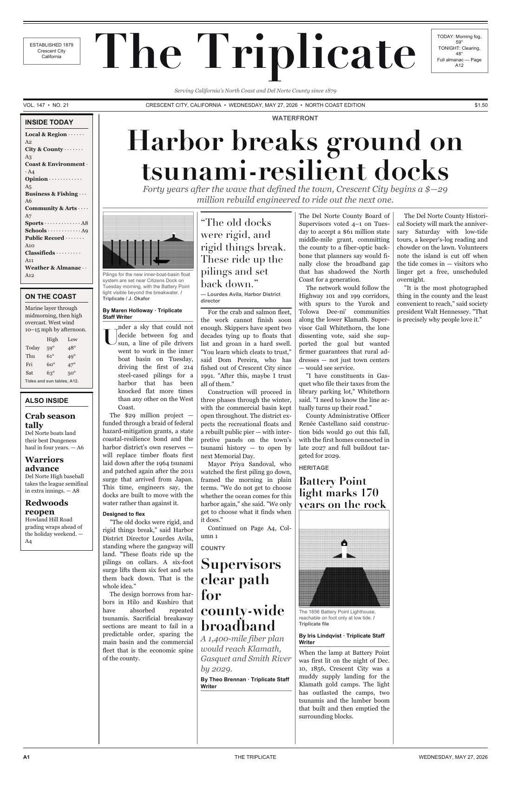

# Documentation Index — `template_newspaper`

| Doc | What it covers |
|-----|----------------|
| [quickstart.md](quickstart.md) | Render the paper in three commands |
| [architecture.md](architecture.md) | Drawn-furniture / flowed-body design; module map |
| [syntax_guide.md](syntax_guide.md) | Complete `content/` YAML schema |
| [forking_guide.md](forking_guide.md) | Turn *The Triplicate* into your own paper |
| [rendering_pipeline.md](rendering_pipeline.md) | The render chain and pipeline stages |
| [output_conventions.md](output_conventions.md) | What lands in `output/` and where |
| [style_guide.md](style_guide.md) | Code + typographic conventions |
| [testing_philosophy.md](testing_philosophy.md) | Why correctness here is visual |
| [troubleshooting.md](troubleshooting.md) | Fonts, blank pages, over-set, images |
| [faq.md](faq.md) | Common questions |
| [agent_instructions.md](agent_instructions.md) | Rules for AI agents editing this project |

See the project [README](../README.md) for the overview and the page roster.

